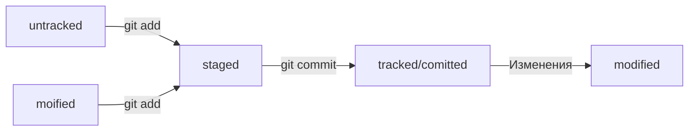

# GIT LEARNING

## Что токое git?

Git - VCS(version control system) система контроля версий, которая позволяет отслеживать изменения в проекте.

## Комманды

1. ls(list directory) - вывести содержимое папки
2. pwd - путь до директории
3. cd(change directory) - сменить папку
```
cd ~/ #домашняя директория
```
4. touch - создать файл
5. mkdir - создать папку
6. cp - копировать
```
cp что куда
```
7. mv - перемещение файлов и папок
8. cat - прочитать содержимое файла
9. rm - удалить файл
10. rmdir - удалить папку
11. clip - скопировать содержимое файла

## TIPS

1. && - ввод сразу нескольких комманд
```
cd ~/ && ls && touch text.txt
```
2. [TAB] - подсказки при вводе комманд

## Инициация репозитория

1. git init - сделать папку репозиторием
2. rm -rf .git - "разгитить" папку
3. git status - проверить состояние репозитория
4. git add - подготовить файл к коммиту
```
git add --all #подготовка всех файлов в директории
```

## Коммит

1. git commit -m "text" - создание коммита с сообщением
2. git log - просмотреть историю коммитов

## Синхронизация удалённого репозитория с локальным

1. git remote add - привязать удалённый репозиторий к локальному
2. git push  - отправить изменения на локальный репозиторий 
```
git push -u origin main #в первый раз
```
## Хеш - идентификатор коммита

Хеширование - способ преобразования набора данных и получения их "отпечатка"
Информация о коммите - это набор данных:
1. Когда был сделан коммит
2. Содержимое файлов в репозитории
3. Ссылка на прошлый (parent) коммит
```
git log --oneline #сокращённый лог 
```

## HEAD

HEAD - указывает на коммит, который был сделан последним

**TIP! можно написать HEAD вместо хеша и тогда git поймёт его как последний коммит**

## Статусы файлов git

1. Untracked - неостслеживаемые файлы
2. Staged - подготовленные к коммиту файлы(в staged area)
3. Tracked - файлы, зафиксированные git commit или добавленные в staging area
4. Modified - отличающиеся от закоммиченой версии файлы

**STAGING AREA = INDEX = CACHE**

**STAGED = INDEXED = CACHED**


## Правила написания сообщений коммитов

Правила:
1. Сообщение легко читается
2. Оно информативное
3. **Все сообщения оформлены в 1 стиле**

## Как исправить коммит

--amend - исправить HEAD коммит

### Добавить файлы в коммит

```
git add --all
git --amend --no-edit #без изменений сообщения
```

### Изменить описание коммита

```
git commit --amend -m "message"
git log --oneline
```

## Откат назад 

git restore --staged file - откатить файл из staging area

git reset --hard hash - откатить коммит до hash

git restore file - откатить файл из modified до последнего коммита

## Просмотр изменений в файлах

git diff A B - посмотреть изменения файлов
```
git diff --staged #посмотреть изменения из staged area
```
echo - выводит в косоль то, что мы ей передали
```
echo "text" >> file.txt #записывает в файл заданную строку
```

## Игнорирование файлов

1. Создаём файл .gitignore
2. Записываем игнорируемые файлы в .gitignore

### Синтаксис: 

1. # - комментарий
2. * - вся папка (*.jpeg)
3. ? - любой символ
4. [...] - игнорирование набора символов ([0-2])
5. ** - вся папка + вложения
6. ! - исключение
7. /file.txt - файл в корне директории
```
**

!**.pdf
!**.tex
```